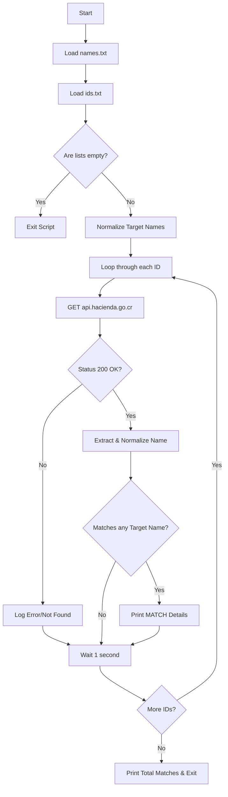

# Costa Rica ID Verifier

A lightweight Python utility designed to cross-reference a list of Costa Rican identification numbers with a list of specific names using the free public API provided by the Ministerio de Hacienda of Costa Rica.

## 📌 Project Status

**Active / Functional** - The script is fully functional and relies entirely on standard Python libraries to query the current Hacienda API.

## 🎯 Problem It Solves

When dealing with lists of Costa Rican IDs (cédulas) and a separate list of names, verifying if a specific ID belongs to someone on your target names list can be a tedious manual process. This tool automates the process by fetching the official registered name for each ID directly from the government database and matching it against your target names, saving time and ensuring accuracy.

## ✨ Main Features

- **Automated Verification:** Queries IDs in bulk without manual intervention.
- **No API Key Required:** Fully utilizes the free public endpoints of the Ministerio de Hacienda.
- **Fuzzy Name Matching:** Normalizes accents (e.g., á, é, í) and capitalization to ensure accurate matches even if names are written differently.
- **Zero External Dependencies:** Built entirely with Python's standard library. No need for `pip install`.
- **Rate Limiting:** Built-in polite delay (1 second per request) to prevent overloading the public free servers.

## 🛠 Technologies Used

- **Language:** Python 3.6+ (Uses f-strings)
- **Libraries (Standard):** `urllib`, `json`, `unicodedata`, `time`, `os`
- **External API:** Ministerio de Hacienda API (Costa Rica)

## 🏗 General Architecture

The project consists of a single execution script (`checker.py`) that reads two input files. It processes the IDs sequentially, queries the API, and performs data normalization to find exact logical matches.



## 📂 Repository Structure

```text
📦 costa-rica-id-verifier
 ┣ 📜 .gitignore     # Git ignore rules for Python
 ┣ 📜 checker.py     # Main execution script
 ┣ 📜 ids.txt        # Input file containing a list of IDs (one per line)
 ┗ 📜 names.txt      # Input file containing a list of target names (one per line)
```

## ✅ Prerequisites

- **Python 3.6 or higher** installed on your system.

## 🚀 Installation

1. **Clone the repository:**
   ```bash
   git clone https://github.com/jrodriguezes/costa-rica-id-verifier.git
   cd costa-rica-id-verifier
   ```

2. **Verify Python installation:**
   ```bash
   python --version
   ```
   *(No virtual environment or dependency installation is needed since everything relies on the standard library).*

## 💻 How to Run in Development

1. **Prepare your data:**
   - Open `names.txt` and add the full names you want to search for, one per line.
   - Open `ids.txt` and add the Costa Rican IDs you want to verify, one per line (numbers only, no dashes or spaces).

2. **Execute the script:**
   From the root directory of the project, run:
   ```bash
   python checker.py
   ```

3. **View Results:**
   The script will display the progress in real-time in your console. If it finds a match between an ID and a target name, it will print a `[MATCH]` notification with the details. At the end, it will output the total number of matches found.

## 🔧 Troubleshooting

- **`ID [Number] not found in Hacienda.`**: This means the Hacienda API returned a 404 or 400 error. The ID might be invalid or not registered in the system.
- **`Exception checking ID [Number]: HTTP 429`**: You are sending requests too fast and have been rate-limited. Ensure the `time.sleep(1.0)` remains in `checker.py`.
- **Missing Names/IDs**: Ensure `names.txt` and `ids.txt` are in the exact same directory as `checker.py` and are saved with UTF-8 encoding.

## ⚠️ Security & Important Considerations

- **API Limits:** The script includes an intentional delay (`time.sleep(1.0)`) to be respectful of the free government API. Do not remove this delay if querying a large number of IDs to avoid getting your IP temporarily blocked.
- **Data Privacy:** This tool sends identification numbers over HTTPS to a public government API. Ensure you comply with local data protection laws (such as PRODHAB in Costa Rica) when processing and handling lists of personal identification numbers.

## 🤝 How to Contribute

1. Fork the repository.
2. Create a new branch (`git checkout -b feature/improvement`).
3. Commit your changes (`git commit -m 'Add new feature'`).
4. Push to the branch (`git push origin feature/improvement`).
5. Open a Pull Request.
